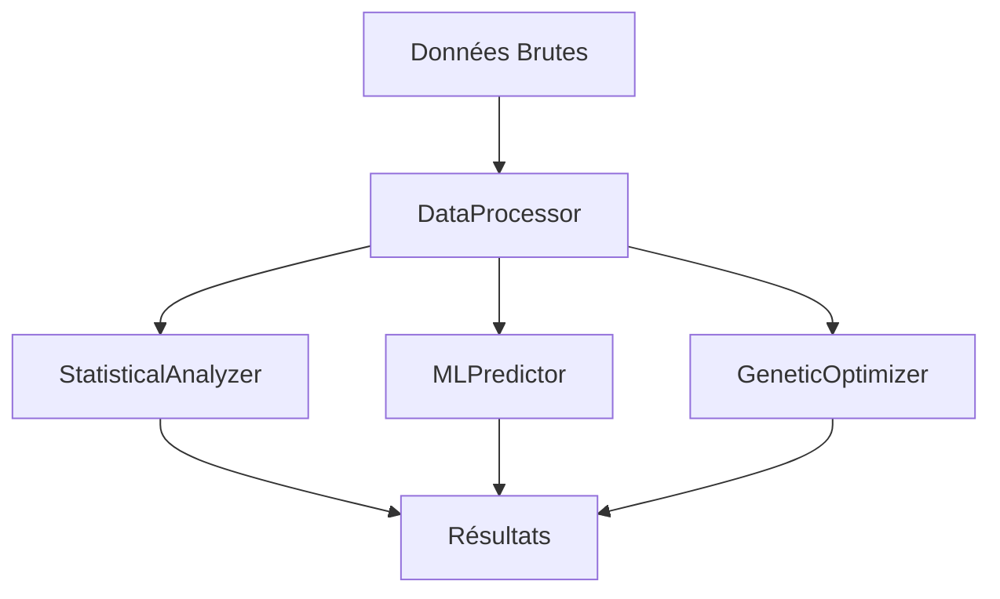

# Documentation Technique - Py-Stats-Toolkit

## Table des Matières
1. [Architecture](#architecture)
2. [Modules](#modules)
3. [API Reference](#api-reference)
4. [Exemples Avancés](#exemples-avancés)
5. [Bonnes Pratiques](#bonnes-pratiques)

## Architecture

### Structure du Projet
```
py-stats-toolkit/
├── stats/
│   ├── analyzer.py
│   ├── distributions.py
│   ├── correlation.py
│   └── time_series.py
├── ml/
│   ├── predictor.py
│   ├── classifier.py
│   ├── regressor.py
│   └── clustering.py
├── genetic/
│   ├── optimizer.py
│   ├── selection.py
│   ├── mutation.py
│   └── crossover.py
└── utils/
    ├── data_processor.py
    ├── file_handler.py
    ├── logger.py
    └── config.py
```

### Flux de Données


## Modules

### Module Statistique
```python
from py_stats_toolkit.stats import StatisticalAnalyzer

# Configuration
config = {
    'method': 'pearson',
    'confidence_level': 0.95,
    'bootstrap_samples': 1000
}

# Initialisation
analyzer = StatisticalAnalyzer(config)

# Analyse
results = analyzer.analyze(
    data=your_data,
    features=['col1', 'col2'],
    target='target_col'
)
```

### Module Machine Learning
```python
from py_stats_toolkit.ml import MLPredictor

# Configuration du modèle
model_config = {
    'algorithm': 'random_forest',
    'n_estimators': 100,
    'max_depth': 10
}

# Initialisation
predictor = MLPredictor(model_config)

# Entraînement
predictor.train(
    X_train=X_train,
    y_train=y_train,
    validation_split=0.2
)

# Prédiction
predictions = predictor.predict(X_test)
```

### Module Génétique
```python
from py_stats_toolkit.genetic import GeneticOptimizer

# Configuration de l'optimisation
optimizer_config = {
    'population_size': 100,
    'generations': 50,
    'mutation_rate': 0.1,
    'crossover_rate': 0.8
}

# Initialisation
optimizer = GeneticOptimizer(optimizer_config)

# Optimisation
solution = optimizer.optimize(
    objective_function=your_function,
    constraints=your_constraints,
    bounds=your_bounds
)
```

## API Reference

### StatisticalAnalyzer
```python
class StatisticalAnalyzer:
    def __init__(self, config: dict = None):
        """
        Initialise l'analyseur statistique.
        
        Args:
            config (dict): Configuration de l'analyseur
        """
        pass

    def analyze(self, data: pd.DataFrame, features: list, target: str) -> dict:
        """
        Effectue l'analyse statistique.
        
        Args:
            data (pd.DataFrame): Données à analyser
            features (list): Liste des caractéristiques
            target (str): Variable cible
            
        Returns:
            dict: Résultats de l'analyse
        """
        pass
```

### MLPredictor
```python
class MLPredictor:
    def __init__(self, model_config: dict):
        """
        Initialise le prédicteur ML.
        
        Args:
            model_config (dict): Configuration du modèle
        """
        pass

    def train(self, X_train: np.ndarray, y_train: np.ndarray, **kwargs) -> None:
        """
        Entraîne le modèle.
        
        Args:
            X_train (np.ndarray): Données d'entraînement
            y_train (np.ndarray): Labels d'entraînement
            **kwargs: Arguments supplémentaires
        """
        pass
```

## Exemples Avancés

### Analyse Statistique Avancée
```python
from py_stats_toolkit.stats import StatisticalAnalyzer, DistributionAnalyzer

# Configuration avancée
config = {
    'method': 'pearson',
    'confidence_level': 0.95,
    'bootstrap_samples': 1000,
    'outlier_detection': True,
    'normality_test': True
}

# Initialisation
analyzer = StatisticalAnalyzer(config)
dist_analyzer = DistributionAnalyzer()

# Analyse complète
results = analyzer.analyze(
    data=your_data,
    features=['col1', 'col2'],
    target='target_col',
    advanced=True
)

# Analyse de distribution
dist_results = dist_analyzer.analyze(
    data=your_data['col1'],
    test_type='ks'
)
```

### Optimisation Génétique Avancée
```python
from py_stats_toolkit.genetic import GeneticOptimizer, SelectionStrategy

# Configuration avancée
config = {
    'population_size': 100,
    'generations': 50,
    'mutation_rate': 0.1,
    'crossover_rate': 0.8,
    'selection_strategy': 'tournament',
    'elitism': True
}

# Initialisation
optimizer = GeneticOptimizer(config)
selection = SelectionStrategy('tournament')

# Optimisation avec contraintes
solution = optimizer.optimize(
    objective_function=your_function,
    constraints=your_constraints,
    bounds=your_bounds,
    callback=your_callback
)
```

## Bonnes Pratiques

### Gestion des Données
1. **Prétraitement**
   - Normalisation des données
   - Gestion des valeurs manquantes
   - Détection des outliers

2. **Validation**
   - Validation croisée
   - Tests statistiques
   - Vérification des hypothèses

3. **Performance**
   - Utilisation de numpy pour les calculs
   - Parallélisation des opérations
   - Gestion de la mémoire

### Documentation du Code
```python
def your_function(param1: type, param2: type) -> return_type:
    """
    Description détaillée de la fonction.
    
    Args:
        param1 (type): Description du paramètre 1
        param2 (type): Description du paramètre 2
        
    Returns:
        return_type: Description de la valeur de retour
        
    Raises:
        ExceptionType: Description de l'exception
        
    Examples:
        >>> your_function(param1, param2)
        expected_output
    """
    pass
```

### Tests Unitaires
```python
import pytest
from py_stats_toolkit.stats import StatisticalAnalyzer

def test_statistical_analyzer():
    # Arrange
    config = {'method': 'pearson'}
    analyzer = StatisticalAnalyzer(config)
    data = pd.DataFrame({'col1': [1, 2, 3], 'col2': [4, 5, 6]})
    
    # Act
    results = analyzer.analyze(data, ['col1'], 'col2')
    
    # Assert
    assert 'correlation' in results
    assert results['correlation'] > 0
``` 